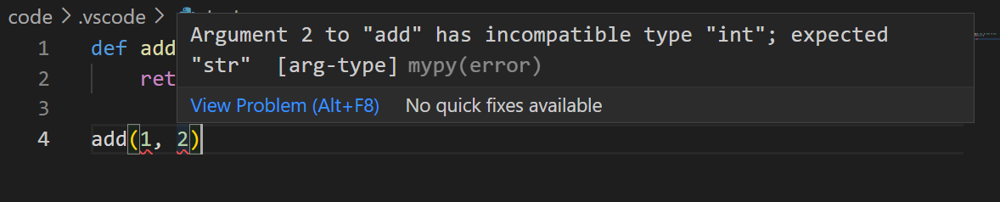

# Add folder

- each VSCode window is called a 'workspace'
- typically 1 workspace == 1 git repository

To get started:
Add the root of a git repository to a workspace

(in CodeOcean, the capsule root is added automatically)


---

# File explorer

By default, `.vscode/settings.json` will be added, which stores config for the
current workspace (window)


---

# Extensions

MVP:

- `Python`: needed to run scripts, analyse code, debug
- `Python Environment Manager`
- `Gitlens`: adds UI for many basic git features: remote, commits, branches
- `Jupyter`: needed to run interactive cells or notebooks

`Github Copilot` (subscription required)

---

# Shortcuts

`Ctrl + Tab`: cycle open editor windows
`Ctrl + Q`: cycle sidebar tabs

`Ctrl + P`: go to file
`Ctrl + Shift + P`: go to settings

- `Alt + up/down` to move lines

- `Ctrl + D` to select multiple instances of word (multi-cursor)

---

# Tips

- sign-in with github account to sync settings across devices

---
# errors at runtime
```python
def add(x, y)
    return x + y


>>> add(1, 2)
3

>>> add('1', '2')
'12'

>>> add(1, '2')
Traceback (most recent call last):
...
TypeError: unsupported operand type(s) for +: 'int' and 'str'
```

---
# type hints

introduced in Python 3.5
https://peps.python.org/pep-0484/

Support for optional annotation of types in function signatures, variable assignments...

Allows VSCode to analyse code *before* runtime and highlight errors like a spell-checker

```python
def add(x: str, y: str) -> int:
    return int(x + y)
```




--- 
\+ spot errors sooner
\+ clarify thinking about classes, functions, types
\+ code as documentation beats doctrings


\- initial learning curve
\- slower development overall

---
# mypy
To enable type-checking in VSCode
- `pip install mypy`
- add to `.vscode/settings.json`:
    ```json
    {
        "python.linting.mypyEnabled": true
    }
    ```
